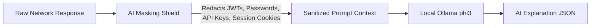

# KAVACH 6.0 — AI System & Local LLM Integration Architecture

KAVACH Version: 5.0  
Documentation Status: CURRENT  
Last Updated: 2026-09-23  
Source of Truth: Current repository implementation (`backend/app/services/ai_analysis_service.py`, `backend/app/services/ai_masking_service.py`, `backend/app/services/knowledge_service.py`, `backend/app/api/routes/ai.py`)

---

## 1. Architectural Philosophy: AI as an Assistant, Not an Oracle

### Simple Explanation
Think of KAVACH's AI like a legal consultant reviewing a physical document. The security engine and safe network probes are the investigators who photograph the crime scene (gathering raw evidence). The AI then reads that photograph and writes an easy-to-read summary explaining what the law says about it. The AI does **NOT** go looking for new crimes on its own, it cannot guess or make up evidence, and if the AI is offline or asleep, the raw physical evidence remains 100% valid and verified.

### Technical Explanation
In KAVACH, Artificial Intelligence is strictly auxiliary to the deterministic security state machine. The security engine and safe network probes discover objective facts; the AI explains, contextualizes, and translates those facts for humans.
$$\textbf{Security Engine Finds Facts} \longrightarrow \textbf{Evidence Proves Facts} \longrightarrow \textbf{AI Explains Facts} \longrightarrow \textbf{User Verifies Facts}$$

### Strict Operational Principles
- **AI = Hypothesis & Natural Language Explanation**: AI outputs provide analytical context, developer remediation explanations, and human-readable summaries.
- **Evidence = Confirmation**: A vulnerability is confirmed solely by empirical protocol responses and cryptographic hashes. AI analysis can never transition a finding to `CONFIRMED`.
- **Negative Bounding**: Prompts explicitly forbid the AI from speculating beyond the provided evidence or claiming unverified impacts.
- **Zero Hallucination Tolerance**: The platform never relies on AI for network probing, CVSS calculations, or state transitions.

---

## 2. Real-World Architecture & Local Runtime

### A. Local Ollama Server (`IMPLEMENTED + TESTED LOCALLY`)
- **Server Address:** `http://127.0.0.1:11434`
- **Active Model Observed:** `phi3:mini` (3.8B parameters, quantized GGUF).
- **Communication Protocol:** Asynchronous HTTP POST via `httpx.AsyncClient` with a strict 30.0-second timeout.
- **Air-Gapped Sovereign Boundary:** All prompts and responses stay on `127.0.0.1`. No prompt tokens or target data ever leave the local machine or cross the public internet.

### B. Retrieval-Augmented Generation (RAG) & Vector Fallback (`IMPLEMENTED + TESTED LOCALLY`)
When synthesizing explanations, KAVACH retrieves authoritative security context from its local curated knowledge base (`knowledge_service.py`):
- **Primary Retrieval:** Local FAISS/Chroma vector embeddings (if initialized).
- **Observed Fallback Mode:** `LEXICAL_FALLBACK` (Exact keyword and token matching on CWE ID, OWASP category, and vulnerability title).
- **Current Finding-Specific Grounding for A018:**
  1. `CWE-200`: Exposure of Sensitive Information to an Unauthorized Actor.
  2. `OWASP A05:2021`: Security Misconfiguration (API documentation exposure).
  3. Authoritative remediation standards for FastAPI, OpenAPI, and Swagger UI disabling in production.

---

## 3. The Data Masking Shield (`ai_masking_service.py`)

Before any probe transcript, HTTP header set, or code snippet is formatted into an AI prompt, it passes through an automated masking filter:

### Masking Rules
- **Bearer Tokens / JWTs:** Masked to `eyJ...[REDACTED_JWT]...`
- **API Keys & Passwords:** Matched via entropy analysis and regex, replaced with `[REDACTED_SECRET]`
- **Session Cookies:** `Set-Cookie` session identifiers replaced with `[REDACTED_COOKIE]`
- **Internal IP Addresses:** RFC 1918 private subnets masked if present.

---

## 4. Bounded AI Output Principles for A018

During the verification of finding `WM-API-DOCS-A018`, initial unconstrained AI output tended to hallucinate catastrophic impacts (e.g., claiming clickjacking, remote code execution, or full database exfiltration). KAVACH enforces a 5-point bounded prompt structure:

1. **Observed Fact:** Explicitly state what was returned (`HTTP 200 OK`, `application/json`, OpenAPI 3.1.0 specification).
2. **Supported Interpretation:** The interactive documentation exposes internal endpoint signatures, query parameters, and schema definitions.
3. **Not-Proven Negative Boundaries:** Explicitly disclaim that this finding does **NOT** prove:
   - Backend database compromise
   - Data exfiltration or sensitive user record extraction
   - Privilege escalation or administrative takeover
   - Clickjacking or UI redressing
   - Integrity or availability compromise
4. **Evidence-Specific Remediation:** Instruct developers on how to disable `/openapi.json` and `/docs` in production environments (e.g., setting `docs_url=None, openapi_url=None` in FastAPI).
5. **Safe Verification Command:** Provide non-destructive curl command to verify the fix.

---

## 5. Graceful Degradation & Deterministic Fallback Engine

If the local Ollama instance is not running, times out, or runs out of VRAM/memory, KAVACH switches instantly to its **Deterministic Rule-Based Intelligence Engine** (`ai_analysis_service.py:get_rule_based_fallback`):
- **Zero Platform Crash:** The UI never freezes or fails.
- **Visual Tagging:** The response carries `"source": "RULE_BASED_FALLBACK"`.
- **Pre-Compiled Knowledge Templates:** Provides structured, curated summaries for CWE-200, OWASP A05, and known exposure patterns.
- **Full Operational Continuity:** Executive reports, technical verification cards, and re-test workflows function with 100% parity.

---

## 6. Verification Status Matrix

| Component | Status | Empirical Reference |
| :--- | :--- | :--- |
| **Local Ollama Integration** | IMPLEMENTED + TESTED LOCALLY | `127.0.0.1:11434`, model `phi3` |
| **RAG Knowledge Engine** | IMPLEMENTED + TESTED LOCALLY | `LEXICAL_FALLBACK` active; grounds CWE-200 & OWASP A05 |
| **Prompt Masking Shield** | IMPLEMENTED + TESTED LOCALLY | Redacts sensitive tokens prior to LLM dispatch |
| **Deterministic Rule Fallback**| IMPLEMENTED + TESTED LOCALLY | Seamless fallback when Ollama is offline |
| **Bounded Prompt Guardrails** | IMPLEMENTED + VERIFIED ON AUTHORIZED WORLD MONITOR | Prohibits AI from claiming clickjacking or unproven compromise |
