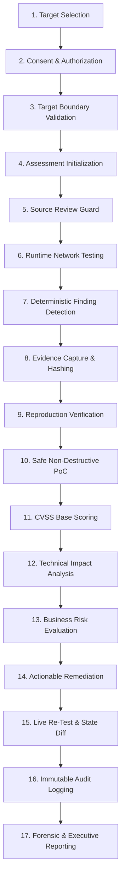
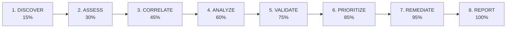

# KAVACH 6.0 — Assessment Flow & Workflow Specification

> **KAVACH Version:** 5.0  
> **Documentation Status:** CURRENT (IMPLEMENTED + VERIFIED)  
> **Last Updated:** 2026-09-23  
> **Source of Truth:** Current repository implementation  

---

## 1. Dual Perspective Architecture: Conceptual Workflow vs Executable Pipeline

KAVACH 6.0 harmonizes two complementary perspectives of cybersecurity testing:
1. **The 17-Step Conceptual Security Methodology**: The human-centric, comprehensive engineering lifecycle from legal consent to final audit.
2. **The 8-Stage Executable Pipeline**: The automated, machine-orchestrated runtime pipeline executed by the backend engine (`assessment_service.py`).

These are **not** contradictory workflows. The 8-stage executable pipeline is the automated engine that fulfills the 17-step security methodology.

---

## 2. The 17-Step Conceptual Security Methodology

### Conceptual Steps Breakdown
1. **Target Selection**: Operator enters destination URL (`https://www.worldmonitor.app`).
2. **Consent & Authorization**: Operator must explicitly confirm ownership or legal written testing permission.
3. **Target Boundary Validation**: System validates network routability, domain format, and edge reachability.
4. **Assessment Initialization**: Unique `assessment_id` (`KAVACH-WM-20260923-A018`) generated in SQLite.
5. **Source Review Guard**: Evaluates if an authorized local repository path exists before enabling source checks.
6. **Runtime Network Testing**: Dispatches non-destructive HTTP GET queries against standard paths.
7. **Deterministic Finding Detection**: Identifies public accessibility of sensitive schema (`WM-API-DOCS-A018`).
8. **Evidence Capture & Hashing**: Captures HTTP response body and seals it with a SHA-256 digest (`EV-WM-API-DOCS-A018-GET`).
9. **Reproduction Verification**: Confirms observation repeatability across independent HTTP requests.
10. **Safe Non-Destructive PoC**: Documents benign curl reproduction command.
11. **CVSS Base Scoring**: Calculates standard CVSS:3.1 base metrics (`5.3`).
12. **Technical Impact Analysis**: AI explains reconnaissance and attack surface mapping implications.
13. **Business Risk Evaluation**: Applies mathematical prioritization formula yielding **`5.92 / 10.0`** (Medium Priority).
14. **Actionable Remediation**: Synthesizes specific code/config playbooks to disable or authenticate the endpoint.
15. **Live Re-Test & State Diff**: Re-runs live network probe, captures after-fix evidence (`EVD-AFT-*`), and computes diff (`STILL_OPEN`).
16. **Immutable Audit Logging**: Appends timestamped audit events to `audit_events` ledger.
17. **Forensic & Executive Reporting**: Generates deduplicated PDF/HTML reports and standardized JSON exports.

---

## 3. The 8-Stage Executable Pipeline

The backend orchestrator (`assessment_service.py`) automates this methodology across 8 discrete executable stages:

| Executable Stage | Conceptual Steps Fulfilled | Telemetry Scoping Rule |
| :--- | :--- | :--- |
| **`DISCOVER`** | Steps 1, 2, 3, 4 | Shows only discovery and surface mapping events (`ASSESSMENT_STARTED`, `TARGET_SELECTED`). |
| **`ASSESS`** | Steps 5, 6, 7 | Shows only rule execution and observation capture (`TEST_EXECUTED`, `OBSERVATION_CAPTURED`). Zero `RETEST_*` events. |
| **`CORRELATE`** | Steps 7, 8 | Shows only taxonomy mapping events (`KNOWLEDGE_CORRELATED`, `TAXONOMY_MAPPED`). |
| **`ANALYZE`** | Steps 12, 13 | Shows only AI analysis and RAG retrieval events (`AI_ANALYSIS_COMPLETED`). |
| **`VALIDATE`** | Steps 8, 9, 10 | Shows only baseline evidence validation (`EVIDENCE_GENERATED`, `FINDING_CREATED`). Zero `RETEST_*` events. |
| **`PRIORITIZE`** | Steps 11, 13 | Shows only risk calculation events (`RISK_CALCULATED`). |
| **`REMEDIATE`** | Step 14 | Shows only remediation playbook generation (`REMEDIATION_CREATED`). |
| **`REPORT`** | Steps 16, 17 | Shows only report export events (`ASSESSMENT_COMPLETED`, `REPORT_GENERATED`). |

---

## 4. Telemetry Scoping Guarantees

- **No Stage Leakage**: Executable stage logs display only events emitted during that specific stage's execution window.
- **Re-Test Event Isolation**: Subsequent re-testing activities (Steps 15-16) emit `RETEST_*` events that remain exclusively in the **Global Audit Trail** and **Live Activity feed**.
- **Stage Model Integrity**: When Stage 8 completes, status becomes `COMPLETED` and progress reaches `100%`. No invalid transitions (`COMPLETE → REPORT`) are permitted.
