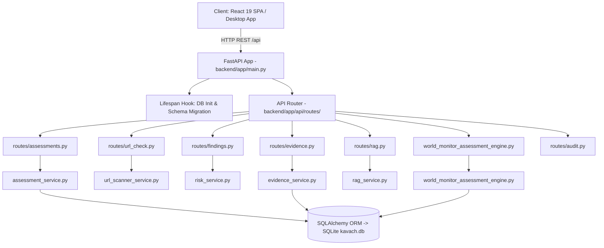

# KAVACH 6.0 — Backend Architecture Reference

> **KAVACH Version:** 5.0  
> **Documentation Status:** CURRENT (IMPLEMENTED + VERIFIED)  
> **Last Updated:** 2026-09-23  
> **Source of Truth:** Current repository implementation  
> **Framework:** FastAPI `^0.115.0` on Uvicorn `^0.30.0`  
> **Database:** SQLite 3 via SQLAlchemy `^2.0.30` (WAL Mode Enabled)  

---

## 1. Architectural Principles

The KAVACH Backend is engineered around five core tenets:
1. **Asynchronous Non-Blocking I/O:** Built with `FastAPI` and `httpx.AsyncClient` to ensure network scanning, probe execution, and threat feed queries never block the web dashboard.
2. **Localhost Binding Security:** Bound strictly to `127.0.0.1:8000` to prevent unintended external exposure on local network interfaces.
3. **Deterministic Persistence:** All assessment results, discovery records, findings, evidence objects, and audit events are durably persisted in `kavach.db`.
4. **Resilient Offline Fallback:** Automatic graceful fallback when external AI services (Ollama) or external public feeds (CISA KEV) are offline.
5. **Strict Stage & Event Scoping:** Execution telemetry is strictly isolated to its corresponding pipeline stage; post-assessment re-test events are preserved in the global audit trail.

---

## 2. Application Entry Point & Lifespan (`backend/app/main.py`)

- **Lifespan Manager:** On application startup, initializes all SQLAlchemy database tables (`Base.metadata.create_all`) and executes idempotent schema migrations (`migrate_schema`) to ensure zero database crashes across version updates.
- **Data Seeding:** Automatically seeds curated CWE/OWASP knowledge records and initial demo records via `seed_database(db)`.
- **CORS Configuration:** Allows local development and production origins (`http://localhost:5173`, `http://127.0.0.1:5173`, `http://localhost:8000`).
- **Static Asset Mounting:** If `frontend/dist` exists, mounts the compiled single-page application at root `/` for standalone portable web deployment.

---

## 3. Core Backend Services

| Service | File | Core Functionality | Verification Status |
| :--- | :--- | :--- | :--- |
| **Assessment Service** | `assessment_service.py` | Orchestrates 8-stage security assessments and manages assessment state transitions (`QUEUED`, `RUNNING`, `COMPLETED`, `FAILED`). | `IMPLEMENTED + TESTED LOCALLY` |
| **World Monitor Engine** | `world_monitor_assessment_engine.py` | Specialized live runtime probe and re-test engine for `worldmonitor.app` target. | `IMPLEMENTED + VERIFIED ON AUTHORIZED WORLD MONITOR` |
| **URL Scanner Service** | `url_scanner_service.py` | Performs non-destructive HTTP/HTTPS probing, TLS metadata extraction, and defensive response header audits. | `IMPLEMENTED + TESTED LOCALLY` |
| **Evidence Service** | `evidence_service.py` | Calculates SHA-256 integrity hashes, manages canonical active proof vs historical artifacts, and enforces deduplication. | `IMPLEMENTED + VERIFIED ON AUTHORIZED WORLD MONITOR` |
| **Risk Service** | `risk_service.py` | Computes deterministic priority score (0.00 to 10.00) based on CVSS base, evidence strength, exploitability, and environment. | `IMPLEMENTED + VERIFIED ON AUTHORIZED WORLD MONITOR` |
| **Correlation Service** | `correlation_service.py` | Maps findings to official CWE taxonomies and canonical OWASP Top 10 categories. | `IMPLEMENTED + TESTED LOCALLY` |
| **AI Analysis Service** | `ai_analysis_service.py` | Generates bounded, evidence-grounded technical analysis and remediation summaries using local Ollama. | `IMPLEMENTED + TESTED LOCALLY` |
| **RAG Service** | `rag_service.py` | Retrieves trusted security playbooks using local lexical keyword search with ChromaDB fallback. | `IMPLEMENTED + TESTED LOCALLY` |
| **Audit Service** | `audit_service.py` | Appends immutable, chronological audit records for all pipeline and re-test lifecycle events. | `IMPLEMENTED + TESTED LOCALLY` |
| **Report Service** | `report_service.py` | Generates executive and forensic HTML/PDF reports with deduplicated proof counts. | `IMPLEMENTED + TESTED LOCALLY` |

---

## 4. 8-Stage Pipeline Model

The backend orchestrator executes across 8 canonical pipeline stages:
1. `DISCOVER` (15%): Attack surface mapping & asset seeding.
2. `ASSESS` (30%): Vulnerability assessment & rule execution.
3. `CORRELATE` (45%): Taxonomy mapping to CWE & OWASP.
4. `ANALYZE` (60%): AI context augmentation & hypothesis generation.
5. `VALIDATE` (75%): Technical verification & PoC generation.
6. `PRIORITIZE` (85%): CVSS & deterministic risk scoring.
7. `REMEDIATE` (95%): Fix guidance & mitigation playbooks.
8. `REPORT` (100%): Executive narrative & forensic package generation (`status = "COMPLETED"`).

---

## 5. Security & Boundary Controls

- **Authorization Gate**: Every scan initiation requires `authorization_confirmed: true`.
- **Non-Destructive Scanning**: Strictly read-only HTTP GET/OPTIONS requests; zero payload fuzzing or injection attempts against live endpoints.
- **Localhost Isolation**: Backend binds to `127.0.0.1` and communicates with local Ollama daemon on `127.0.0.1:11434`.
- **Database Safety**: WAL mode with busy timeout handling prevents SQLite lock deadlocks.
