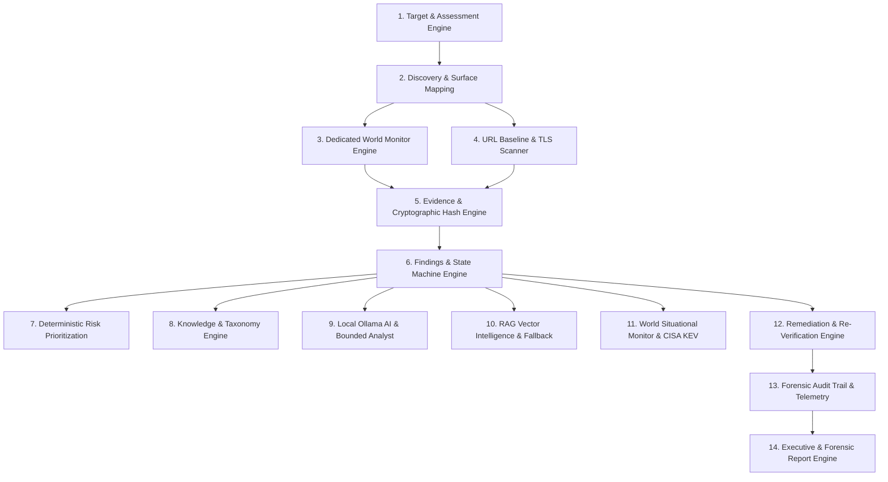

# KAVACH 6.0 — Core Functional Modules Specification

> **KAVACH Version:** 5.0  
> **Documentation Status:** CURRENT (IMPLEMENTED + VERIFIED)  
> **Last Updated:** 2026-09-23  
> **Source of Truth:** Current repository implementation  
> **Platform Architecture:** Integrated Defensive Cybersecurity Assessment & Intelligence Engine  

---

## Complete Module Breakdown

---

### Module 01: Target & Assessment Engine
- **Purpose**: Manages target initialization, environment selection (Production, Staging, Testing), scope definition, authorization gate enforcement, and 8-stage pipeline advancement.
- **Code Location**: `backend/app/services/assessment_service.py`, `frontend/src/pages/AssessmentProgressPage.tsx`.
- **Verification Status**: `IMPLEMENTED + TESTED LOCALLY`

### Module 02: Discovery & Surface Mapping
- **Purpose**: Maps reachable endpoints, asset components, interactive API surfaces, and authorization boundaries.
- **Code Location**: `backend/app/services/discovery_service.py`.
- **Verification Status**: `IMPLEMENTED + TESTED LOCALLY`

### Module 03: Dedicated World Monitor Engine
- **Purpose**: Specialized engine for `https://www.worldmonitor.app` executing live runtime HTTP GET probes to identify interactive documentation endpoints (`/openapi.json`), detecting OpenAPI 3.1.0 schemas.
- **Code Location**: `backend/app/services/world_monitor_assessment_engine.py`.
- **Verification Status**: `IMPLEMENTED + VERIFIED ON AUTHORIZED WORLD MONITOR`

### Module 04: URL Baseline & TLS Scanner
- **Purpose**: Audits HTTP/HTTPS redirects, TLS certificate expiry/metadata, and defensive response headers (`HSTS`, `CSP`, `X-Frame-Options`, `CORS`, `Server` disclosures).
- **Code Location**: `backend/app/services/url_scanner_service.py`, `frontend/src/pages/UrlSecurityCheckPage.tsx`.
- **Verification Status**: `IMPLEMENTED + TESTED LOCALLY`

### Module 05: Evidence & Cryptographic Hash Engine
- **Purpose**: Captures raw HTTP network responses and AST code observations, calculates immutable SHA-256 digests, and manages canonical active proofs vs historical artifacts.
- **Code Location**: `backend/app/services/evidence_service.py`, `frontend/src/pages/EvidenceValidationPage.tsx`.
- **Verification Status**: `IMPLEMENTED + VERIFIED ON AUTHORIZED WORLD MONITOR`

### Module 06: Findings & State Machine Engine
- **Purpose**: Enforces strict lifecycle state transitions (`POTENTIAL` → `CONFIRMED` → `STILL_OPEN` / `RESOLVED`). Separates technical evidence confirmation from remediation status.
- **Code Location**: `backend/app/api/routes/findings.py`, `frontend/src/pages/FindingsCatalogPage.tsx`.
- **Verification Status**: `IMPLEMENTED + TESTED LOCALLY`

### Module 07: Deterministic Risk Prioritization
- **Purpose**: Computes mathematical risk priority score (`5.92 / 10.0` for A018) combining CVSS base, evidence strength, exploitability, and environment multiplier.
- **Code Location**: `backend/app/services/risk_service.py`, `frontend/src/pages/RiskScoringPage.tsx`.
- **Verification Status**: `IMPLEMENTED + VERIFIED ON AUTHORIZED WORLD MONITOR`

### Module 08: Knowledge & Taxonomy Engine
- **Purpose**: Maps findings to official taxonomies (`CWE-200` to `OWASP A05:2021 Security Misconfiguration`) and provides baseline vulnerability definitions.
- **Code Location**: `backend/app/services/correlation_service.py`, `backend/app/data/seed_data.py`.
- **Verification Status**: `IMPLEMENTED + TESTED LOCALLY`

### Module 09: Local Ollama AI & Bounded Analyst
- **Purpose**: Synthesizes human-readable explanations and remediation summaries using local `phi3` without internet communication. Constrained by strict negative-bounding rules.
- **Code Location**: `backend/app/services/ai_analysis_service.py`, `backend/app/services/ollama_service.py`.
- **Verification Status**: `IMPLEMENTED + TESTED LOCALLY`

### Module 10: RAG Vector Intelligence & Fallback
- **Purpose**: Ingests trusted security documentation and retrieves relevant remediation context using lexical keyword matching (`LEXICAL_FALLBACK`) or ChromaDB.
- **Code Location**: `backend/app/services/rag_service.py`.
- **Verification Status**: `IMPLEMENTED + TESTED LOCALLY`

### Module 11: World Situational Monitor & CISA KEV
- **Purpose**: Ingests external authoritative threat feeds (CISA KEV, NVD CVE). Isolates global alerts from local target findings unless technology stack directly matches.
- **Code Location**: `backend/app/services/world_monitor_assessment_engine.py`, `frontend/src/pages/WorldMonitorPage.tsx`.
- **Verification Status**: `IMPLEMENTED + VERIFIED ON AUTHORIZED WORLD MONITOR`

### Module 12: Remediation & Re-Verification Engine
- **Purpose**: Provides actionable playbooks and executes live after-fix probes. Performs deterministic state diffing to verify if a finding is `STILL_OPEN` or `RESOLVED`.
- **Code Location**: `backend/app/services/remediation_service.py`, `backend/app/services/world_monitor_assessment_engine.py`, `frontend/src/components/common/ReVerificationModal.tsx`.
- **Verification Status**: `IMPLEMENTED + VERIFIED ON AUTHORIZED WORLD MONITOR`

### Module 13: Forensic Audit Trail & Telemetry
- **Purpose**: Maintains a permanent, chronological log of all pipeline and re-test events. Scopes stage execution telemetry to prevent post-assessment event leakage.
- **Code Location**: `backend/app/services/audit_service.py`, `frontend/src/pages/AuditTrailPage.tsx`.
- **Verification Status**: `IMPLEMENTED + TESTED LOCALLY`

### Module 14: Executive & Forensic Report Engine
- **Purpose**: Generates deduplicated executive summaries (1 finding = 1 proof) and detailed technical appendices in printable HTML, PDF, and standardized JSON formats.
- **Code Location**: `backend/app/services/report_service.py`, `backend/app/services/forensic_export_service.py`, `frontend/src/pages/SecurityReportPage.tsx`.
- **Verification Status**: `IMPLEMENTED + TESTED LOCALLY`
