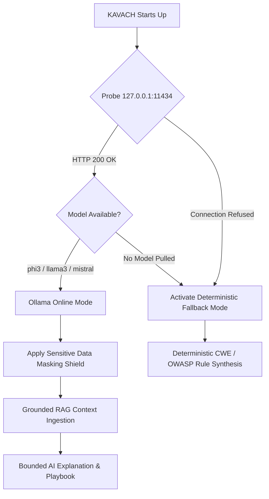

# KAVACH 6.0 — Local Ollama AI & Offline Fallback Architecture

> **KAVACH Version:** 5.0  
> **Documentation Status:** CURRENT (IMPLEMENTED + VERIFIED)  
> **Last Updated:** 2026-09-23  
> **Source of Truth:** Current repository implementation  
> **Component:** Local Sovereign AI Inference Engine  
> **Default Endpoint:** `http://127.0.0.1:11434`  
> **Observed Active Model:** `phi3` (or `phi3:mini`)  

---

## 1. Principles of Sovereign Local AI

KAVACH integrates Local Large Language Models with strict data privacy boundaries:
1. **100% Private Local Inference:** Zero prompts, finding details, or scanned file data ever leave the operator's machine.
2. **No Cloud API Keys:** Does not depend on OpenAI, Anthropic, or external third-party cloud APIs.
3. **Graceful Offline Fallback:** If Ollama is offline or uninstalled, KAVACH does **not** fail or crash. It automatically activates deterministic rule-based security intelligence.
4. **Evidence Bounded Grounding:** AI functions strictly as a technical explainer and hypothesis generator; it has **no authority** to confirm vulnerabilities. Only empirical evidence can confirm a finding.

---

## 2. Prompt Masking Shield

Before any prompt is dispatched to the local Ollama instance, the payload passes through the `PromptShield` filter:
- **Redaction Patterns**: Matches and replaces API keys (`AKIA[0-9A-Z]{16}`), bearer tokens, database connection strings, and plaintext passwords with `[REDACTED_SECRET]`.
- **Target Obfuscation**: Option to tokenize internal target IP addresses or internal hostnames into anonymized identifiers (`target.internal.scope`).

---

## 3. Four AI Output Grounding Principles

To prevent hallucinations and speculative overclaiming, the local LLM operates under four mandatory output constraints:
1. **Observed Fact**: Restrict factual assertions strictly to what raw HTTP response codes and headers directly prove (e.g. "Endpoint `/openapi.json` returned HTTP 200 OK with `application/json` payload").
2. **Supported Interpretation**: Frame risks accurately according to standard taxonomy (e.g. "The finding represents an information disclosure and reconnaissance risk, enabling mapping of internal API routes").
3. **Not-Proven Boundaries**: Explicitly state what is **not** proven by the evidence (e.g. "This evidence does NOT demonstrate backend execution, data manipulation, privilege escalation, or server compromise").
4. **Targeted Remediation**: Confine remediation playbooks to the specific component affected (e.g. disabling interactive documentation in production settings).

---

## 4. Model Selection Order

On initialization, `ollama_service.py` queries `GET /api/tags` on `127.0.0.1:11434` and prioritizes:
1. `phi3` / `phi3:mini` (verified low-latency model for security triage)
2. `llama3` / `llama3:latest`
3. `mistral` / `mistral:latest`
4. `deepseek-r1` / `deepseek-coder`
5. First available pulled model in the local tag library.

---

## 5. Offline Fallback Behavior

When Ollama is unavailable:
- The system logs an informational warning: `[Ollama] Local daemon unreachable on port 11434. Falling back to deterministic rule synthesis.`
- The findings and evidence screens display deterministic knowledge summaries extracted directly from `seed_data.py`.
- Assessment execution, risk scoring, report generation, and re-testing continue with 100% operational fidelity.
