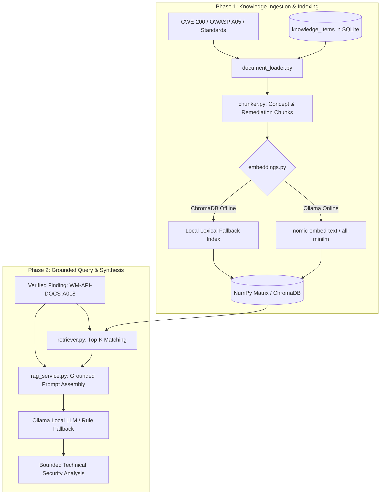

# KAVACH 6.0 — RAG (Retrieval-Augmented Generation) Architecture

> **KAVACH Version:** 5.0  
> **Documentation Status:** CURRENT (IMPLEMENTED + VERIFIED)  
> **Last Updated:** 2026-09-23  
> **Source of Truth:** Current repository implementation  
> **Subsystem:** Grounded Security Intelligence & Vector Retrieval Engine  
> **Observed Active Mode:** `LEXICAL_FALLBACK` (Active when local ChromaDB is unavailable)  

---

## 1. Executive Summary & Purpose

The **KAVACH RAG Pipeline** solves the primary challenge of using Large Language Models in cybersecurity: **hallucinations, fabricated CVEs, and ungrounded speculative advice**.

Instead of allowing the LLM to invent vulnerabilities, KAVACH:
1. **Retrieves** authoritative security knowledge chunks (MITRE CWE standards, OWASP Top 10 guidelines, NIST hardening baselines) from a local vector store or lexical index.
2. **Augments** the LLM prompt with verified technical finding evidence and top-K retrieved standards.
3. **Generates** a strictly bounded analysis citing explicit standards and actionable, non-destructive remediation steps.

---

## 2. Supported Knowledge Topics

Curated high-density security reference documents cover:
- **`CWE-200`**: Exposure of Sensitive Information to an Unauthorized Actor (OpenAPI / Swagger UI interactive documentation endpoints).
- **`CWE-693`**: Protection Mechanism Failure (`HSTS`, `CSP`, `X-Frame-Options` missing headers).
- **`CWE-798`**: Hardcoded Credentials & Cloud Secrets (AWS IAM keys, private tokens).
- **`CWE-89`**: SQL Injection & Parameterized Query Defenses.
- **`CWE-639`**: Insecure Direct Object References (IDOR).
- **`CWE-319`**: Cleartext Transmission of Sensitive Information (HTTP to HTTPS).
- **`CWE-942`**: Permissive Cross-Origin Resource Sharing (CORS).
- **`CWE-79`**: Cross-Site Scripting (XSS) & Context-Aware Output Encoding.

---

## 3. Retrieval Modes & Fallback

- **Vector Semantic Search**: When embeddings service is active, queries are vectorized and compared against chunk embeddings using cosine similarity.
- **Lexical Keyword Fallback (`LEXICAL_FALLBACK`)**: When vector databases are offline, KAVACH switches to deterministic term-frequency matching based on finding title, CWE identifier, and component tags. This mode was validated during the recent QA cycle and ensures zero disruption to analysis workflows.

---

## 4. Prompt Assembly & Negative Bounding

The retrieved context is injected into a strictly bounded prompt template:
- *Evidence Input*: HTTP method, URL, status code, content type, raw response snippet, SHA-256 hash.
- *Negative Constraints*: "Do NOT assume remote code execution or database access. State only what the HTTP response proves. Restrict recommendations to disabling or authenticating the exposed schema endpoint."
