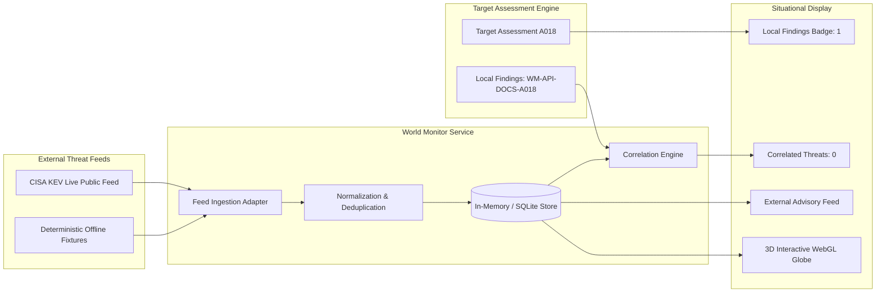

# KAVACH 6.0 — World Monitor & Situational Awareness Architecture

KAVACH Version: 5.0  
Documentation Status: CURRENT  
Last Updated: 2026-09-23  
Source of Truth: Current repository implementation (`backend/app/services/world_monitor_service.py`, `backend/app/api/routes/world_monitor.py`, `frontend/src/pages/CommandCenterPage.tsx`, `frontend/src/components/CinematicEarth.tsx`)

---

## 1. Overview & Operational Purpose

### Simple Explanation
The World Monitor is like a real-time global weather radar for cyber threats. Instead of only looking at the local target in a vacuum, it checks global security advisories (such as CISA alerts) to see what attacks are actively happening across the globe. However, just because a storm is happening in another country does not mean your house is flooded: KAVACH strictly separates global threat news from your application's actual local findings unless there is concrete, verified proof connecting them.

### Technical Explanation
The World Monitor subsystem provides contextual cybersecurity situational awareness by ingesting external threat feeds, actively exploited CVE catalogs, and global infrastructure alerts, then comparing them against local assessment findings. It provides:
1. **Live External Threat Ingestion**: Asynchronous fetching of CISA Known Exploited Vulnerabilities (KEV).
2. **Deterministic Offline Fallbacks**: Pre-packaged, verified offline demo fixtures tagged with `is_demo: true`.
3. **Assessment-Scoped Correlation**: Correlation algorithms matching local findings against external advisories based on strict criteria (Exact CVE ID or matching software component).
4. **Advisory vs. Vulnerability Isolation**: Strict enforcement that external advisories are NOT local vulnerabilities, and shared CWE taxonomies alone do NOT create false correlations.



---

## 2. Verified Active Baseline Assessment: KAVACH-WM-20260923-A018

The active, empirically verified benchmark assessment executed against the authorized World Monitor target is documented below:

| Field | Verified Value | Verification State |
| :--- | :--- | :--- |
| **Assessment ID** | `KAVACH-WM-20260923-A018` | IMPLEMENTED + VERIFIED ON AUTHORIZED WORLD MONITOR |
| **Target URL** | `https://www.worldmonitor.app` | IMPLEMENTED + VERIFIED ON AUTHORIZED WORLD MONITOR |
| **Scan Mode** | `HYBRID` (Live Network Probing + Local Engine) | IMPLEMENTED + VERIFIED ON AUTHORIZED WORLD MONITOR |
| **Final State** | `COMPLETED` / Progress: `100%` / Stage: `REPORT` | IMPLEMENTED + VERIFIED ON AUTHORIZED WORLD MONITOR |
| **Total Findings** | `1` | IMPLEMENTED + VERIFIED ON AUTHORIZED WORLD MONITOR |
| **Finding ID** | `WM-API-DOCS-A018` | IMPLEMENTED + VERIFIED ON AUTHORIZED WORLD MONITOR |
| **Finding Title** | `Publicly Exposed Interactive API Schema & Documentation` | IMPLEMENTED + VERIFIED ON AUTHORIZED WORLD MONITOR |
| **Severity** | `MEDIUM` | IMPLEMENTED + VERIFIED ON AUTHORIZED WORLD MONITOR |
| **Confirmation State** | `CONFIRMED` | IMPLEMENTED + VERIFIED ON AUTHORIZED WORLD MONITOR |
| **Canonical Evidence** | `EV-WM-API-DOCS-A018-GET` | IMPLEMENTED + VERIFIED ON AUTHORIZED WORLD MONITOR |
| **Historical Baseline Evidence** | `EV-WM-API-DOCS-A018` (Retained for audit history) | IMPLEMENTED + VERIFIED ON AUTHORIZED WORLD MONITOR |
| **Canonical Probe** | `GET /openapi.json` | IMPLEMENTED + VERIFIED ON AUTHORIZED WORLD MONITOR |
| **Observed HTTP Status** | `HTTP 200 OK` | IMPLEMENTED + VERIFIED ON AUTHORIZED WORLD MONITOR |
| **Observed Content-Type** | `application/json; charset=utf-8` | IMPLEMENTED + VERIFIED ON AUTHORIZED WORLD MONITOR |
| **OpenAPI Specification** | `3.1.0` | IMPLEMENTED + VERIFIED ON AUTHORIZED WORLD MONITOR |
| **Schema Title** | `WorldMonitor API` | IMPLEMENTED + VERIFIED ON AUTHORIZED WORLD MONITOR |
| **Authentication State** | `UNAUTHENTICATED` | IMPLEMENTED + VERIFIED ON AUTHORIZED WORLD MONITOR |
| **Authorization State** | `PUBLIC` | IMPLEMENTED + VERIFIED ON AUTHORIZED WORLD MONITOR |
| **CWE ID** | `CWE-200: Exposure of Sensitive Information to an Unauthorized Actor` | IMPLEMENTED + VERIFIED ON AUTHORIZED WORLD MONITOR |
| **OWASP Category** | `A05:2021 Security Misconfiguration` | IMPLEMENTED + VERIFIED ON AUTHORIZED WORLD MONITOR |
| **CVE Identifier** | `Not identified` (Target-specific architecture exposure) | IMPLEMENTED + VERIFIED ON AUTHORIZED WORLD MONITOR |
| **NVD CVSS Score** | `Not available` | IMPLEMENTED + VERIFIED ON AUTHORIZED WORLD MONITOR |
| **Deterministic Priority** | `5.92 / 10.0` (Medium Priority) | IMPLEMENTED + VERIFIED ON AUTHORIZED WORLD MONITOR |
| **Current Re-Test Lifecycle** | `STILL_OPEN` (Endpoint remains publicly accessible) | IMPLEMENTED + VERIFIED ON AUTHORIZED WORLD MONITOR |
| **Correlated Global Advisories** | `0` (Zero direct matches; no false attribution) | IMPLEMENTED + VERIFIED ON AUTHORIZED WORLD MONITOR |
| **Local Findings Count** | `1` (Correctly assessment-scoped on situational screen) | IMPLEMENTED + VERIFIED ON AUTHORIZED WORLD MONITOR |

> [!IMPORTANT]
> **Anti-Exaggeration Boundary:**  
> The empirical evidence for `WM-API-DOCS-A018` proves solely that the interactive OpenAPI 3.1.0 schema specification is accessible over public HTTP without authentication.  
> It does **NOT** prove or imply:
> - Backend server compromise
> - Arbitrary database or user data extraction
> - Privilege escalation or administrative takeover
> - Lateral network movement
> - Clickjacking or UI redressing
> - Data integrity or system availability compromise  
> It represents reconnaissance and endpoint-discovery exposure.

---

## 3. External Threat Ingestion Architecture

### A. Live CISA KEV Ingestion (`IMPLEMENTED + TESTED LOCALLY`)
- **Feed URL:** `https://www.cisa.gov/sites/default/files/feeds/known_exploited_vulnerabilities.json`
- **Transport:** Asynchronous HTTP GET via `httpx.AsyncClient` with a 5.0-second timeout.
- **Authentication:** None required (Public US Government CISA dataset).
- **Data Extracted:** `cveID`, `vendorProject`, `product`, `vulnerabilityName`, `dateAdded`, `shortDescription`, `requiredAction`.
- **Labeling:** Records parsed from this feed are tagged `is_demo: false`.

### B. Deterministic Offline Fallback Fixtures (`IMPLEMENTED + TESTED LOCALLY`)
When internet connectivity is absent or the external endpoint fails, KAVACH loads 6 deterministic fixtures with `is_demo: true`:
1. `DEMO-CVE-2023-44487`: HTTP/2 Rapid Reset Denial of Service (Global Infrastructure).
2. `DEMO-CISA-2024-001`: Widespread Exploitation of Missing HSTS & Defensive Headers (United States).
3. `DEMO-CVE-2024-6387`: regreSSHion OpenSSH Unauthenticated Remote Code Execution (Germany).
4. `DEMO-ADV-CLOUD-OUTAGE`: Regional Cloud Edge BGP Routing Misconfiguration (United Kingdom).
5. `DEMO-CVE-2024-3094`: XZ Utils / liblzma Supply Chain Compromise (India).
6. `DEMO-ADV-FASTAPI-UVICORN`: Python ASGI Server Header Information Disclosure (Singapore).

---

## 4. Threat-to-Finding Correlation Engine & Anti-False-Positive Rules

### The Core Correlation Rule
In KAVACH, **an external threat advisory is not a local vulnerability**, and **a shared CWE does not constitute correlation**.

```
External Advisory != Local Target Vulnerability
Shared CWE != Correlated Threat
```

### Correlation Evaluation Rules (`backend/app/services/world_monitor_service.py`)
1. **High Confidence Correlation:** Requires an **exact CVE ID match** between an active external advisory and a local finding's verified CVE field.
2. **Medium Confidence Correlation:** Requires an **exact technology stack or package name match** (e.g., both explicitly targeting `OpenSSH 9.2` or `FastAPI 0.100.0`).
3. **CWE Sharing Rejected:** If an advisory is for `CVE-2023-44487` (`CWE-400`) and the target has a `CWE-400` finding, KAVACH does **NOT** correlate them unless the underlying software package is proven identical.
4. **Behavior on A018:** Finding `WM-API-DOCS-A018` is an exposure of OpenAPI schema (`CWE-200`). There is no matching CISA KEV entry for World Monitor's proprietary API schema. Therefore, the correlation engine outputs:
   - **Correlated Threats:** `0`
   - **External Advisory Display:** `NO DIRECT LOCAL MATCH`

---

## 5. User Interface & Scoping Consistency

### A. Navigation & Routing (`IMPLEMENTED + VERIFIED`)
- **Command Center:** Accessible at route `/command-center` or sidebar "Command Center".
- **World Situational Monitor:** Accessible at route `/world-monitor` or sidebar "World Monitor".
- Independent route definitions in `frontend/src/App.tsx` and native desktop tabs in `ui/world_monitor_page.py`.

### B. Local Findings Scoping (`IMPLEMENTED + VERIFIED`)
The World Situational Monitor displays a badge indicating the number of local findings for the target. Previously, this showed global database counts or 0. It is now strictly scoped to the active assessment:
- For `KAVACH-WM-20260923-A018`: **1 local finding**.

### C. 3D Earth Globe (`IMPLEMENTED + VERIFIED`)
Rendered using Three.js WebGL in `frontend/src/components/CinematicEarth.tsx`:
- Geographic coordinate positioning for global advisory origin locations.
- Pulsing threat beacons colored by severity (`CRITICAL`, `HIGH`, `MEDIUM`, `LOW`).
- Arcs representing threat propagation pathways.
- Offline graceful rendering when WebGL is available.

---

## 6. API Reference

| Method | Endpoint | Scope | Purpose | Auth |
| :--- | :--- | :--- | :--- | :--- |
| `GET` | `/api/world-monitor/events` | Global | Retrieves cached threat events with filters for category, severity, and `is_demo`. | None (Local) |
| `POST` | `/api/world-monitor/refresh` | Global | Triggers fresh pull from CISA KEV public JSON feed or reloads demo fixtures. | None (Local) |
| `GET` | `/api/world-monitor/sources` | Global | Returns operational status of all configured threat feed adapters. | None (Local) |
| `POST` | `/api/world-monitor/correlate` | Assessment | Accepts finding list and returns verified correlated threat objects. | None (Local) |

---

## 7. Verification Status & Known Limitations

- **Live Ingestion:** IMPLEMENTED + TESTED LOCALLY. Ingests CISA KEV feed when internet connectivity is active.
- **Correlation Isolation:** IMPLEMENTED + VERIFIED ON AUTHORIZED WORLD MONITOR. Zero false correlations created for A018.
- **NVD Streaming:** PLANNED / NOT IMPLEMENTED. Full continuous NVD 2.0 streaming is not integrated; external advisory links point directly to official NVD detail URLs.
- **Source Code Provenance:** Unverified source code findings are strictly quarantined and never promoted without verified repository provenance.
