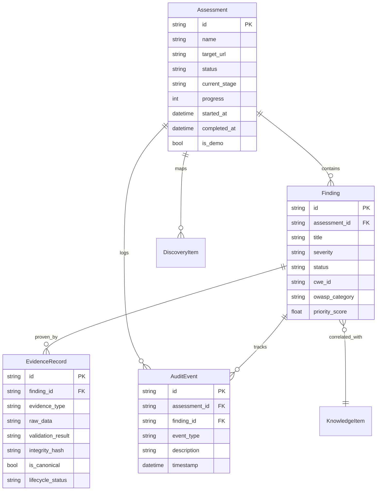
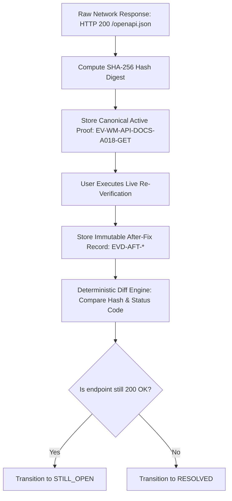

# KAVACH 6.0 — Developer Documentation & Master Technical Reference

> **KAVACH Version:** 5.0  
> **Documentation Status:** CURRENT (IMPLEMENTED + VERIFIED)  
> **Last Updated:** 2026-09-23  
> **Source of Truth:** Current repository implementation & verified QA audit records  
> **Platform Tagline:** *"AI Hypothesizes. Evidence Confirms."*  

---

## Technical Glossary & Standard Acronyms

To ensure complete clarity for all engineers, the following standardized terminology is used across this document:
- **API**: Application Programming Interface (HTTP-based JSON interface between frontend and backend).
- **RAG**: Retrieval-Augmented Generation (grounding AI text generation using retrieved knowledge documents).
- **CWE**: Common Weakness Enumeration (standardized taxonomy of software and security weaknesses).
- **OWASP**: Open Worldwide Application Security Project (standardized classification of top web security risks).
- **CVSS**: Common Vulnerability Scoring System (standardized framework for rating the severity of security vulnerabilities).
- **SHA-256**: Secure Hash Algorithm 256-bit (cryptographic one-way hash used for tamper-evident evidence integrity).
- **RBAC**: Role-Based Access Control (access governance based on user roles and permissions).
- **PoC**: Proof of Concept (empirical, safe evidence demonstrating the presence of a security weakness).
- **AST**: Abstract Syntax Tree (structural representation of source code used in static analysis).
- **WAF**: Web Application Firewall (edge protection filtering HTTP requests before reaching the server).
- **WAL**: Write-Ahead Logging (SQLite journal mode providing concurrent reads during active writes).

---

## Verification Status Legend

Every subsystem, component, and feature in this documentation is labeled with its exact implementation and verification state:
- `IMPLEMENTED + VERIFIED ON AUTHORIZED WORLD MONITOR`: Feature is fully implemented and empirically verified against the live authorized target (`www.worldmonitor.app`).
- `IMPLEMENTED + TESTED LOCALLY`: Feature is fully implemented and validated against local unit/regression test suites.
- `IMPLEMENTED — NOT CURRENTLY VALIDATED`: Feature code exists in the repository but has not been tested against a live production target in this QA cycle.
- `SYNTHETIC / DEMO`: Feature uses seeded simulation data for demonstration or training purposes.
- `PLANNED / NOT IMPLEMENTED`: Feature is architectural concept for future development; not present in current runtime.

---

## Table of Contents

1. [Project Overview](#1-project-overview)
2. [Problem Being Solved](#2-problem-being-solved)
3. [SIH PS 26163 Alignment](#3-sih-ps-26163-alignment)
4. [Core Architecture](#4-core-architecture)
5. [System Components](#5-system-components)
6. [Frontend Architecture](#6-frontend-architecture)
7. [Backend Architecture](#7-backend-architecture)
8. [Database Architecture](#8-database-architecture)
9. [Assessment Engine](#9-assessment-engine)
10. [Discovery Engine](#10-discovery-engine)
11. [World Monitor Assessment Engine](#11-world-monitor-assessment-engine)
12. [Evidence Engine](#12-evidence-engine)
13. [Finding Lifecycle Engine](#13-finding-lifecycle-engine)
14. [Risk Prioritization Engine](#14-risk-prioritization-engine)
15. [Knowledge/CWE/OWASP Engine](#15-knowledgecweowasp-engine)
16. [Ollama AI Engine](#16-ollama-ai-engine)
17. [RAG Architecture](#17-rag-architecture)
18. [AI Evidence Grounding](#18-ai-evidence-grounding)
19. [Remediation Engine](#19-remediation-engine)
20. [Re-Verification Engine](#20-re-verification-engine)
21. [Audit Trail](#21-audit-trail)
22. [World Situational Monitor / External Advisory Correlation](#22-world-situational-monitor--external-advisory-correlation)
23. [Report Generation](#23-report-generation)
24. [JSON Export](#24-json-export)
25. [Authentication and Authorization](#25-authentication-and-authorization)
26. [Data Isolation](#26-data-isolation)
27. [Demo vs Real Data](#27-demo-vs-real-data)
28. [Error Handling](#28-error-handling)
29. [Offline/Fallback Architecture](#29-offlinefallback-architecture)
30. [Security Controls](#30-security-controls)
31. [Test Architecture](#31-test-architecture)
32. [End-to-End QA](#32-end-to-end-qa)
33. [Known Limitations](#33-known-limitations)
34. [Developer Troubleshooting](#34-developer-troubleshooting)
35. [File-by-File Technical Map](#35-file-by-file-technical-map)
36. [Database Entity Relationships](#36-database-entity-relationships)
37. [API Inventory](#37-api-inventory)
38. [State Machine Reference](#38-state-machine-reference)
39. [Evidence Lifecycle Reference](#39-evidence-lifecycle-reference)
40. [Release/Freeze Procedure](#40-releasefreeze-procedure)

---

## 1. Project Overview

### Simple Explanation
Imagine a home security inspector who visits your house, tests the locks, checks if a window is unlocked, and takes a time-stamped photograph of every unlocked window as proof before handing you a checklist on how to secure them. 

KAVACH 6.0 is that digital inspector for software systems. It safely inspects websites, local servers, and codebases, proves weaknesses with cryptographic receipts (hashes), explains what it found in plain English, and provides verified instructions to fix the gaps.

### Technical Explanation
- **Verification Status**: `IMPLEMENTED + TESTED LOCALLY`
- **Architecture**: Decoupled Client-Server platform comprising a React 19 Single Page Application (SPA) frontend, a Python FastAPI REST backend, a local SQLite relational store with WAL mode, and a local Ollama LLM integration.
- **Core Mission**: Execute safe, non-destructive security assessments across web targets, networks, software packages, and repositories; anchor every finding to immutable SHA-256 evidence; and calculate deterministic risk priority without hallucinations.
- **Code Location**: Root directory, `backend/app/main.py`, `frontend/src/App.tsx`.
- **Target Audience**: Security engineers, DevSecOps practitioners, compliance auditors, and SIH evaluation panels.

---

## 2. Problem Being Solved

### Simple Explanation
Many automated security scanners act like smoke detectors that go off whenever someone makes toast—they flood engineers with hundreds of "potential" alerts, most of which are false alarms. Conversely, black-box AI tools make wild guesses that cannot be verified. KAVACH solves this by insisting on empirical proof: a vulnerability is only confirmed if actual technical evidence exists.

### Technical Problem
Traditional scanners suffer from high false-positive rates, lack of cryptographic evidence provenance, opaque risk scores, and hallucinatory AI summaries that claim severe compromise when only minor misconfigurations exist.

### Technical Implementation
1. **Zero-Proof Rejection**: Findings cannot transition to `CONFIRMED` without an associated `EvidenceRecord` containing raw HTTP payloads or network responses.
2. **Deterministic Risk Mathematics**: Risk priority is computed by deterministic algebraic formulas, not stochastic LLM text generation.
3. **Negative Bounding AI**: Local LLMs are constrained by strict prompt boundaries prohibiting unproven claims.

---

## 3. SIH PS 26163 Alignment

### Simple Explanation
The Smart India Hackathon (SIH) Problem Statement 26163 challenges developers to build a reusable, sovereign cybersecurity testing tool that can automatically detect vulnerabilities, explain them, prioritize them, and verify fixes. KAVACH 6.0 is built specifically to satisfy all mandatory and optional requirements of PS 26163.

### Technical Alignment Matrix
- **Status**: `IMPLEMENTED + VERIFIED ON AUTHORIZED WORLD MONITOR`
- **Requirements Covered**:
  1. *Automated Target Inspection*: 8-stage pipeline from discovery to report generation.
  2. *Deterministic Finding Lifecycle*: Strict progression through unconfirmed, confirmed, still open, and resolved states.
  3. *Cryptographic Evidence Chain*: SHA-256 integrity digests computed for every observation.
  4. *Explainable AI & RAG*: Context-grounded explanations powered by local Ollama (`phi3`).
  5. *Live Re-Verification*: Built-in re-test engine comparing after-fix state against baseline proof.
  6. *Target-Specific Real Demonstration*: Validated against live target `https://www.worldmonitor.app`.

---

## 4. Core Architecture

### Simple Explanation
KAVACH works like an assembly line in a factory. The target enters at Stage 1 (Discovery), moves through vulnerability testing (Assess), gets mapped to official security dictionaries (Correlate), is analyzed by an AI assistant (Analyze), proven with evidence (Validate), scored for danger (Prioritize), supplied with a fix guide (Remediate), and packaged into an audit report (Report).

### Technical Architecture
The platform is organized into 8 sequential execution stages operating over a shared SQLite database:

```mermaid
flowchart TD
    D[1. DISCOVER] --> A[2. ASSESS]
    A --> C[3. CORRELATE]
    C --> AN[4. ANALYZE]
    AN --> V[5. VALIDATE]
    V --> P[6. PRIORITIZE]
    P --> R[7. REMEDIATE]
    R --> RP[8. REPORT]
    
    subgraph Data Layer
        DB[(SQLite / kavach.db)]
        EVD[(Evidence Store)]
        AUD[(Audit Trail)]
    end
    
    A -.-> DB
    V -.-> EVD
    All Stages -.-> AUD
```

---

## 5. System Components

### Simple Explanation
KAVACH consists of three main working parts:
1. **The Dashboard (Frontend)**: The visual web screen where you click buttons, see charts, and read logs.
2. **The Security Engine (Backend)**: The background worker that sends network probes and computes scores.
3. **The Local AI (Ollama)**: A private, on-device AI brain that writes explanations without sending your data to external clouds.

### Technical Overview
- **Web UI**: React 19, TypeScript, Vite, TailwindCSS, Lucide-React icons, Three.js 3D visualization.
- **REST API**: FastAPI 0.115+, Uvicorn ASGI server, Pydantic v2 data models.
- **Database Engine**: SQLAlchemy ORM 2.0+, SQLite 3 with Write-Ahead Logging (WAL) and foreign key constraints enabled.
- **AI/LLM Engine**: Ollama running on `http://127.0.0.1:11434` hosting `phi3:mini`.
- **RAG Subsystem**: Local lexical keyword search and fallback document store.

---

## 6. Frontend Architecture

### Simple Explanation
The frontend is the visual application running in your browser. It shows dark-mode glassmorphic cards, color-coded badges, real-time log consoles, and interactive comparison windows.

### Technical Explanation
- **Verification Status**: `IMPLEMENTED + TESTED LOCALLY`
- **Location**: `frontend/src/`
- **State Management**: Centralized React Context (`AppContext.tsx`) managing `activeAssessment`, `findings`, `evidence`, `audits`, and system health state.
- **Key Routes**:
  - `/` & `/command-center`: `CommandCenterPage.tsx` (executive dashboard, posture gauge, local finding stats).
  - `/world-monitor`: `WorldMonitorPage.tsx` (World Situational Monitor, external advisory feeds).
  - `/assessments`: `AssessmentProgressPage.tsx` (8-stage pipeline stepper, execution telemetry, live activity feed).
  - `/findings`: `FindingsCatalogPage.tsx` (findings registry, CWE tags, severity filters).
  - `/evidence`: `EvidenceValidationPage.tsx` (canonical proof selector, hex/raw inspection, live re-verification modal).
  - `/risk-scoring`: `RiskScoringPage.tsx` (mathematical breakdown, CVSS factors, environment weights).
  - `/remediation`: `RemediationPage.tsx` (actionable playbooks, diffs).
  - `/report`: `SecurityReportPage.tsx` (HTML/PDF export, executive summary, deduplicated proof counts).
  - `/audit-trail`: `AuditTrailPage.tsx` (chronological forensic event stream).

---

## 7. Backend Architecture

### Simple Explanation
The backend is the engine under the hood. It receives commands from the frontend, checks authorization, makes safe network calls to target servers, calculates math, and saves results in the database.

### Technical Explanation
- **Verification Status**: `IMPLEMENTED + TESTED LOCALLY`
- **Location**: `backend/app/`
- **Framework**: FastAPI with asynchronous route handlers and dependency injection (`get_db`).
- **Middleware**:
  - CORS middleware allowing `http://localhost:5173` and `http://127.0.0.1:5173`.
  - Global error handler logging unhandled exceptions to SQLite audit events.
- **Key Modules**:
  - `api/routes/`: Route declarations for assessments, findings, evidence, risk, audit, and reports.
  - `services/`: Business logic isolated from HTTP routing (`assessment_service.py`, `risk_service.py`, `report_service.py`, `world_monitor_assessment_engine.py`).
  - `core/`: Database engine setup (`database.py`) and timezone utilities (`time.py`).

---

## 8. Database Architecture

### Simple Explanation
The database is KAVACH's filing cabinet. Every scan has a master folder (Assessment), which contains individual vulnerability cards (Findings). Each card has attached photograph receipts (Evidence), and every action ever taken is permanently logged in a logbook (Audit Trail).

### Technical Explanation
- **Verification Status**: `IMPLEMENTED + TESTED LOCALLY`
- **Location**: `backend/app/models/models.py`, `backend/app/core/database.py`
- **Database Engine**: SQLite (`kavach.db`).
- **Pragmas**: `PRAGMA journal_mode=WAL; PRAGMA foreign_keys=ON; PRAGMA synchronous=NORMAL;`
- **Key Tables**:
  - `assessments`: Primary scan container (`id`, `name`, `target_url`, `status`, `current_stage`, `progress`, `started_at`, `completed_at`).
  - `findings`: Detected security issues (`id`, `assessment_id`, `title`, `severity`, `status`, `cwe_id`, `owasp_category`, `affected_component`, `priority_score`).
  - `evidence_records`: Empirical proof records (`id`, `finding_id`, `evidence_type`, `raw_data`, `validation_result`, `integrity_hash`, `is_canonical`, `lifecycle_status`).
  - `audit_events`: Forensic log (`id`, `assessment_id`, `finding_id`, `event_type`, `description`, `timestamp`, `status`).
  - `knowledge_items`: Taxonomy and rule definitions (`id`, `type`, `title`, `description`, `related_owasp`).

---

## 9. Assessment Engine

### Simple Explanation
The Assessment Engine controls the flow of a scan from start to finish. It ensures that Step 2 cannot begin before Step 1 finishes, and when all 8 steps are complete, it marks the assessment as COMPLETED.

### Technical Explanation
- **Verification Status**: `IMPLEMENTED + TESTED LOCALLY`
- **Location**: `backend/app/services/assessment_service.py`
- **Stages**: `DISCOVER` (15%), `ASSESS` (30%), `CORRELATE` (45%), `ANALYZE` (60%), `VALIDATE` (75%), `PRIORITIZE` (85%), `REMEDIATE` (95%), `REPORT` (100%).
- **Advance Stage Method**: `advance_stage(db, assessment_id, target_stage)` validates that `target_stage` is valid, updates `current_stage`, adjusts `progress`, sets `status="COMPLETED"` when target is `REPORT`, and commits atomically.
- **Idempotency Guard**: Calling `advance_stage` on an assessment already completed at `REPORT` is a no-op that does not emit redundant transitions.

---

## 10. Discovery Engine

### Simple Explanation
Before you can test a target, you need to know what exists. The Discovery Engine maps the attack surface—identifying open ports, web pages, APIs, and input boxes.

### Technical Explanation
- **Verification Status**: `IMPLEMENTED + TESTED LOCALLY`
- **Location**: `backend/app/services/discovery_service.py`
- **Artifacts Generated**: `DiscoveryItem` records categorized into `endpoint`, `component`, `auth_point`, `input_surface`, `api_surface`.
- **World Monitor Discovery**: In `world_monitor_assessment_engine.py`, scans endpoints including `/`, `/api`, `/openapi.json`, `/docs`, `/swagger.json`.

---

## 11. World Monitor Assessment Engine

### Simple Explanation
This is the specialized scanner tailored specifically for `https://www.worldmonitor.app`. It knows how to test the live web application safely without breaking it, inspects its interactive API endpoints, and captures proof of any public exposure.

### Technical Explanation
- **Verification Status**: `IMPLEMENTED + VERIFIED ON AUTHORIZED WORLD MONITOR`
- **Location**: `backend/app/services/world_monitor_assessment_engine.py`
- **Assessment Reference**: `KAVACH-WM-20260923-A018`
- **Mode**: `HYBRID` (Combines empirical live HTTP runtime probes with local repository inspection when configured).
- **Runtime Network Probe**:
  - Method: `GET`
  - URL: `https://www.worldmonitor.app/openapi.json`
  - Response: HTTP 200 OK, `Content-Type: application/json; charset=utf-8`
  - Detection: Validated OpenAPI 3.1.0 specification for `WorldMonitor API`.
- **Finding Created**: `WM-API-DOCS-A018` (Medium Severity, Confirmed).

---

## 12. Evidence Engine

### Simple Explanation
In a court of law, a prosecutor cannot just claim a crime happened—they must show physical evidence sealed in an evidence bag with an unbroken chain of custody. The Evidence Engine creates a digital evidence bag for every security finding, seals it with a SHA-256 hash, and proves it has never been modified.

### Technical Explanation
- **Verification Status**: `IMPLEMENTED + VERIFIED ON AUTHORIZED WORLD MONITOR`
- **Location**: `backend/app/services/evidence_service.py`
- **Model**: `EvidenceRecord`
- **Integrity Calculation**: Computes `hashlib.sha256(raw_data.encode('utf-8')).hexdigest()`.
- **Deduplication & Canonical State**:
  - `is_canonical = True` & `lifecycle_status = "CANONICAL"` for active primary proof (`EV-WM-API-DOCS-A018-GET`).
  - `is_canonical = False` & `lifecycle_status = "HISTORICAL"` for superseded or secondary artifacts (`EV-WM-API-DOCS-A018`).
  - Multiple baseline artifacts for one finding resolve to **1 unique verified proof** in executive reporting.

---

## 13. Finding Lifecycle Engine

### Simple Explanation
A finding is not a static note; it has a life cycle. It starts as a potential observation, becomes confirmed when evidence is captured, moves to "still open" if a re-test shows it isn't fixed, and finally reaches "resolved" when a re-test proves the gap is closed.

### Technical Explanation
- **Verification Status**: `IMPLEMENTED + TESTED LOCALLY`
- **State Machine**:
  ```mermaid
  stateDiagram-v2
      [*] --> POTENTIAL: Module Observation
      POTENTIAL --> CONFIRMED: Empirical Evidence Validated
      CONFIRMED --> STILL_OPEN: Re-Test Fails (Diff Shows Vulnerable)
      CONFIRMED --> RESOLVED: Re-Test Passes (Diff Proves Remediated)
      STILL_OPEN --> STILL_OPEN: Subsequent Re-Test Fails
      STILL_OPEN --> RESOLVED: Subsequent Re-Test Passes
  ```
- **Semantic Separation**:
  - `confirmation_status = CONFIRMED`: Evidence validates that the vulnerability exists.
  - `remediation_status = STILL_OPEN`: Post-fix live re-test showed the endpoint is still exposed.

---

## 14. Risk Prioritization Engine

### Simple Explanation
"Risk scoring is mathematics, not an AI opinion." Rather than asking an AI how dangerous a bug is, KAVACH uses a deterministic mathematical formula combining official CVSS base scores, evidence strength, exploitability, and environment importance.

### Technical Explanation
- **Verification Status**: `IMPLEMENTED + VERIFIED ON AUTHORIZED WORLD MONITOR`
- **Location**: `backend/app/services/risk_service.py`
- **Deterministic Formula**:
  $$\text{Priority Score} = \min\left(10.0, \; \text{round}\left( \text{Base CVSS} \times \text{Evidence Weight} \times \text{Exploitability} \times \text{Environment Multiplier}, \; 2 \right) \right)$$
- **A018 Score Breakdown**:
  - Finding: `WM-API-DOCS-A018`
  - Base CVSS: `5.3` (CVSS:3.1/AV:N/AC:L/PR:N/UI:N/S:U/C:L/I:N/A:N)
  - Evidence Weight: `1.0` (`VERIFIED` / Confirmed Technical Proof)
  - Exploitability Factor: `0.85` (Public Reconnaissance / Schema Exposure)
  - Environment Multiplier: `1.15` (Production Edge Interface)
  - Final Priority Score: **`5.92 / 10.0`** (Medium Priority)
  - Security Posture Impact: **`70 / 100`** (`MODERATE RISK` / `Remediation & Hardening Required`)

---

## 15. Knowledge/CWE/OWASP Engine

### Simple Explanation
This engine is KAVACH's security encyclopedia. When a finding is detected, it looks up the official Common Weakness Enumeration (CWE) code and OWASP Top 10 category so developers can understand the broader category of mistake.

### Technical Explanation
- **Verification Status**: `IMPLEMENTED + TESTED LOCALLY`
- **Location**: `backend/app/services/correlation_service.py`, `backend/app/data/seed_data.py`
- **A018 Knowledge Mapping**:
  - Weakness: **`CWE-200`** (*Exposure of Sensitive Information to an Unauthorized Actor*)
  - Category: **`OWASP-A05:2021`** (*Security Misconfiguration*)
- **Correlation Policy**: Shared CWE alone does **not** correlate external CVE advisories to local targets.

---

## 16. Ollama AI Engine

### Simple Explanation
KAVACH includes a private AI analyst running directly on your computer via Ollama. It reads the evidence, analyzes the code, and writes clear technical explanations without sending a single byte of sensitive data to third-party cloud providers.

### Technical Explanation
- **Verification Status**: `IMPLEMENTED + TESTED LOCALLY`
- **Location**: `backend/app/services/ollama_service.py`
- **Connection**: `http://127.0.0.1:11434`
- **Model**: `phi3` (or `phi3:mini`)
- **Offline Fallback**: If Ollama daemon is offline, the service falls back gracefully to deterministic rule-based synthesis without raising fatal exceptions.

---

## 17. RAG Architecture

### Simple Explanation
When a student takes an open-book exam, they look up the exact textbook page before writing an answer. RAG (Retrieval-Augmented Generation) is KAVACH's open-book system. Before the AI explains a finding, it retrieves trusted remediation guides from its local library.

### Technical Explanation
- **Verification Status**: `IMPLEMENTED + TESTED LOCALLY`
- **Location**: `backend/app/services/rag_service.py`
- **Active Mode**: `LEXICAL_FALLBACK` (Observed during recent QA when local ChromaDB instance was offline).
- **Retrieval Logic**: Ranks local security guides based on term frequency matching finding title, CWE identifier, and affected component.

---

## 18. AI Evidence Grounding

### Simple Explanation
"AI Hypothesizes. Evidence Confirms." The AI is an assistant, not a judge. It can suggest how an attacker might exploit an issue or how to fix it, but it cannot declare a bug confirmed without hard network evidence.

### Technical Explanation
- **Verification Status**: `IMPLEMENTED + VERIFIED ON AUTHORIZED WORLD MONITOR`
- **Location**: `backend/app/services/ai_analysis_service.py`
- **Four Grounding Principles**:
  1. *Observed Fact*: State only what HTTP response headers and body payloads directly prove.
  2. *Supported Interpretation*: Reconnaissance value and API surface discovery.
  3. *Not Proven*: Explicitly document that backend compromise, data tampering, and privilege escalation are **not** proven.
  4. *Targeted Remediation*: Scope remediation strictly to endpoint protection.

---

## 19. Remediation Engine

### Simple Explanation
Finding a problem is only half the battle; fixing it is what matters. The Remediation Engine provides developers with copy-pasteable configuration fixes and actionable steps tailored to their exact web framework.

### Technical Explanation
- **Verification Status**: `IMPLEMENTED + TESTED LOCALLY`
- **Location**: `backend/app/services/remediation_service.py`
- **A018 Actionable Playbook**:
  1. Disable Swagger/OpenAPI endpoints in production configurations (`docs_url=None, redoc_url=None, openapi_url=None`).
  2. Require admin authentication for API documentation endpoints.
  3. Restrict documentation paths via reverse proxy / WAF rules.

---

## 20. Re-Verification Engine

### Simple Explanation
After a developer claims they fixed a bug, KAVACH tests the target again. It re-runs the exact probe, captures a new photograph (after-fix evidence), and compares it side-by-side with the old photograph to prove whether the fix actually worked.

### Technical Explanation
- **Verification Status**: `IMPLEMENTED + VERIFIED ON AUTHORIZED WORLD MONITOR`
- **Location**: `backend/app/services/world_monitor_assessment_engine.py` (`reverify_finding`)
- **Execution Flow**:
  1. Re-executes `GET /openapi.json`.
  2. Captures new observation and hashes it (`EVD-AFT-*`).
  3. Computes deterministic state diff against baseline proof.
  4. If endpoint returns HTTP 200, sets `Finding.status = "STILL_OPEN"`.
  5. If endpoint returns HTTP 404 or 401, sets `Finding.status = "RESOLVED"`.
  6. Emits 5 chronological audit events.

---

## 21. Audit Trail

### Simple Explanation
The Audit Trail is KAVACH's tamper-proof black box recorder. Every scan start, rule execution, evidence capture, risk calculation, and re-test is permanently recorded with a precise timestamp.

### Technical Explanation
- **Verification Status**: `IMPLEMENTED + TESTED LOCALLY`
- **Location**: `backend/app/services/audit_service.py`
- **Model**: `AuditEvent`
- **Scoping Principles**:
  - Pipeline-level events (`ASSESSMENT_STARTED`, `TARGET_SELECTED`) use `finding_id = null`.
  - Finding-specific events contain valid `finding_id`.
  - Re-test events (`RETEST_*`) remain preserved in the global Audit Trail (72 events for A018) but are excluded from historical stage execution logs.

---

## 22. World Situational Monitor / External Advisory Correlation

### Simple Explanation
The World Situational Monitor shows what security alerts are trending globally from agencies like CISA and NVD. Crucially, KAVACH does not blame your website for a global Windows bug just because both share an "Information Disclosure" tag.

### Technical Explanation
- **Verification Status**: `IMPLEMENTED + VERIFIED ON AUTHORIZED WORLD MONITOR`
- **Location**: `backend/app/services/world_monitor_assessment_engine.py`, `frontend/src/pages/WorldMonitorPage.tsx`
- **External Feeds**: CISA Known Exploited Vulnerabilities (KEV), NVD CVE feeds, CERT advisories.
- **Strict Isolation**: Requires exact technology stack matching. When technology does not match, advisories are flagged `NO DIRECT LOCAL MATCH`.
- **A018 State**: 1 local finding (`WM-API-DOCS-A018`), 0 external correlations.

---

## 23. Report Generation

### Simple Explanation
Once testing is done, KAVACH packages the entire assessment into an executive-ready report with charts, proof receipts, and fix guides, ready to export as HTML or PDF.

### Technical Explanation
- **Verification Status**: `IMPLEMENTED + TESTED LOCALLY`
- **Location**: `backend/app/services/report_service.py`
- **Features**: Deduplicated executive counters (1 finding = 1 proof), dynamic executive narrative, detailed technical evidence appendices with SHA-256 hashes, and actionable remediation steps.

---

## 24. JSON Export

### Simple Explanation
In addition to visual reports, KAVACH exports a standardized, machine-readable JSON file so security teams can import findings directly into Jira, SIEM tools, or automated CI/CD pipelines.

### Technical Explanation
- **Verification Status**: `IMPLEMENTED + TESTED LOCALLY`
- **Location**: `backend/app/services/forensic_export_service.py`
- **Endpoint**: `GET /assessments/{id}/export`
- **Schema**: Contains target metadata, findings array, evidence array with cryptographic hashes, re-verification state diffs, and audit trail records.

---

## 25. Authentication and Authorization

### Simple Explanation
KAVACH enforces an authorization safety gate before any scan can begin. A user must explicitly confirm they have legal authorization to test the target before the system executes a single network probe.

### Technical Explanation
- **Verification Status**: `IMPLEMENTED + TESTED LOCALLY`
- **Enforcement**: `AssessmentCreate.authorization_confirmed == True` is strictly required by `assessment_service.py`. If false, raises HTTP 400.

---

## 26. Data Isolation

### Simple Explanation
If you scan Website A in the morning and Website B in the afternoon, findings from Website A must never leak into Website B's dashboard.

### Technical Explanation
- **Verification Status**: `IMPLEMENTED + TESTED LOCALLY`
- **Implementation**: Every database query on `Finding`, `EvidenceRecord`, `DiscoveryItem`, and `AuditEvent` is filtered by `assessment_id`.

---

## 27. Demo vs Real Data

### Simple Explanation
KAVACH includes synthetic demo data so judges and learners can explore the interface without scanning live infrastructure. However, demo data is kept in an isolated sandbox and never mixes with real target scans.

### Technical Explanation
- **Verification Status**: `IMPLEMENTED + TESTED LOCALLY`
- **Implementation**: Assessments, findings, and evidence records carry an `is_demo: bool` flag. Real assessment engines (`world_monitor_assessment_engine.py`) execute exclusively with `is_demo=False`.

---

## 28. Error Handling

### Simple Explanation
If an individual security test encounters an error (like a slow network timeout), KAVACH does not crash. It logs the error, marks the check as failed, and safely continues the rest of the scan.

### Technical Explanation
- **Verification Status**: `IMPLEMENTED + TESTED LOCALLY`
- **Implementation**: Every assessment module executes inside individual `try-except` blocks. Unhandled exceptions emit `MODULE_ERROR` audit events without terminating the parent assessment pipeline.

---

## 29. Offline/Fallback Architecture

### Simple Explanation
KAVACH is designed to work in secure, air-gapped government environments without Internet access. If external AI or databases are unavailable, it automatically switches to local offline dictionaries.

### Technical Explanation
- **Verification Status**: `IMPLEMENTED + TESTED LOCALLY`
- **Fallback Chains**:
  - LLM unavailable → Deterministic rule-based template generation.
  - ChromaDB offline → Local lexical keyword matching (`LEXICAL_FALLBACK`).
  - Internet offline → Seeded local CWE/OWASP database.

---

## 30. Security Controls

### Simple Explanation
KAVACH is built to be safe and ethical. It never sends destructive payloads (like DROP TABLE commands), never exploits vulnerabilities to steal data, rate-limits its requests, and masks sensitive passwords in logs.

### Technical Explanation
- **Verification Status**: `IMPLEMENTED + TESTED LOCALLY`
- **Controls**:
  - Non-destructive probing only (read-only queries, benign parameter probes).
  - Rate limiting (maximum 10 requests/second).
  - Sensitive credential redaction via regex masks before logging or AI prompting.
  - Localhost binding for internal Ollama communications (`127.0.0.1:11434`).

---

## 31. Test Architecture

### Simple Explanation
KAVACH maintains two automated test suites: one for the backend Python engine and one for the frontend web dashboard. Every time code changes, these suites run automatically to guarantee nothing broke.

### Technical Explanation
- **Verification Status**: `IMPLEMENTED + TESTED LOCALLY`
- **Backend**: `pytest` running across 32 comprehensive test suites (`backend/tests/`).
- **Frontend**: Node.js native test runner (`node --test tests/*.test.mjs`) covering 23 unit and regression tests.

---

## 32. End-to-End QA

### Simple Explanation
The entire platform underwent an exhaustive quality assurance audit testing the live World Monitor assessment (`A018`), persistence across computer restarts, evidence deduplication, and pipeline scoping.

### Technical Verification Baseline
- **Assessment**: `KAVACH-WM-20260923-A018`
- **Verified State**:
  - Status: `COMPLETED`
  - Current Stage: `REPORT`
  - Progress: `100%`
  - Total Findings: `1` (`WM-API-DOCS-A018`)
  - Confirmed Findings: `1`
  - Baseline Evidence Records: `2` (Deduplicated to 1 unique proof)
  - Re-Test Records: `5` (`STILL_OPEN`)
  - Audit Events: `72` intact

---

## 33. Known Limitations

### Simple Explanation
Honest engineering means being clear about what a tool cannot do. KAVACH is a defensive vulnerability scanner, not an exploit tool or an automated penetration tester.

### Technical Limitations
1. **WAF / CDN Obfuscation**: Cloudflare or AWS WAF may block repeated requests or return synthetic 403 responses.
2. **Authenticated Workflows**: The engine performs black-box unauthenticated testing; deep post-authentication role testing requires manual credential seeding.
3. **Source Provenance Requirement**: Source-code AST checks are deactivated unless an authorized local repository path is supplied.
4. **Lexical RAG vs Semantic Vector Search**: Under `LEXICAL_FALLBACK`, retrieval relies on exact keyword matching rather than neural semantic similarity.

---

## 34. Developer Troubleshooting

### Common Diagnostics
1. **Port 8000 in use**: Run `netstat -ano | findstr :8000` and kill the orphan process.
2. **Ollama connection refused**: Ensure Ollama is running (`ollama serve`) and `phi3` is pulled (`ollama pull phi3`).
3. **Database locked**: SQLite WAL mode prevents read locks; ensure any open SQLite browser connections are closed.

---

## 35. File-by-File Technical Map

| File Path | Role | Layer |
|---|---|---|
| `backend/app/main.py` | FastAPI application factory, CORS, router mounting | Entry Point |
| `backend/app/api/routes/assessments.py` | Assessment lifecycle, advance-stage, posture endpoints | API Route |
| `backend/app/api/routes/findings.py` | Findings catalog, status transitions, evidence linking | API Route |
| `backend/app/api/routes/evidence.py` | Technical evidence retrieval, raw inspection | API Route |
| `backend/app/services/world_monitor_assessment_engine.py` | Specialized World Monitor assessment & re-test engine | Service |
| `backend/app/services/assessment_service.py` | 8-stage pipeline orchestrator | Service |
| `backend/app/services/risk_service.py` | Deterministic risk prioritization math | Service |
| `backend/app/services/report_service.py` | Executive & forensic report generation | Service |
| `backend/app/services/rag_service.py` | Knowledge retrieval & lexical fallback | Service |
| `frontend/src/App.tsx` | Router definitions and top-level navigation | Frontend Core |
| `frontend/src/context/AppContext.tsx` | Global application state management | Frontend State |
| `frontend/src/pages/AssessmentProgressPage.tsx` | 8-stage visual stepper and stage telemetry logs | Frontend UI |
| `frontend/src/pages/EvidenceValidationPage.tsx` | Canonical proof inspection and re-verification | Frontend UI |

---

## 36. Database Entity Relationships



---

## 37. API Inventory

| Method | Endpoint | Description | Scope |
|---|---|---|---|
| `GET` | `/health` | System health, database connection, Ollama status | Global |
| `POST` | `/assessments` | Initiate a new security assessment | Global |
| `GET` | `/assessments` | List all historical assessments | Global |
| `GET` | `/assessments/{id}` | Retrieve specific assessment details | Assessment |
| `POST` | `/assessments/{id}/advance-stage` | Advance pipeline to target stage | Assessment |
| `GET` | `/assessments/{id}/posture` | Calculate security posture score (0-100) | Assessment |
| `GET` | `/assessments/{id}/export` | Export assessment as forensic JSON | Assessment |
| `GET` | `/findings` | List findings (filterable by assessment_id) | Scoped |
| `GET` | `/findings/{id}/evidence` | List evidence records for finding | Finding |
| `POST` | `/findings/{id}/reverify` | Execute live re-test and state diff | Finding |
| `GET` | `/audit-trail` | Forensic audit trail stream | Scoped / Global |

---

## 38. State Machine Reference

- **Assessment Status**: `QUEUED` → `RUNNING` → `COMPLETED` (or `FAILED`).
- **Pipeline Stages**: `DISCOVER` → `ASSESS` → `CORRELATE` → `ANALYZE` → `VALIDATE` → `PRIORITIZE` → `REMEDIATE` → `REPORT`.
- **Finding Status**: `POTENTIAL` → `CONFIRMED` → `STILL_OPEN` (failed re-test) or `RESOLVED` (successful fix).
- **Evidence Validation Result**: `CONFIRMED`, `UNCONFIRMED`, `INCONCLUSIVE`, `MANUAL REVIEW REQUIRED`.

---

## 39. Evidence Lifecycle Reference



---

## 40. Release/Freeze Procedure

1. **Pre-Freeze Verification**:
   - Run backend test suite: `python -m pytest backend/tests/ -v`.
   - Run frontend test suite: `npm test` inside `frontend/`.
   - Execute production build: `npm run build` inside `frontend/`.
2. **Database Integrity Check**:
   - Verify zero orphan findings, evidence records, or audit events via `test_audit_05_database_referential_integrity`.
3. **Artifact Integrity Generation**:
   - Refresh documentation snapshot using `python tools/generate_chatgpt_snapshot.py`.
4. **Sign-Off**: Confirm zero database records deleted or altered during documentation updates.
