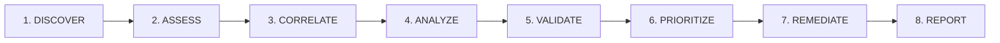

# KAVACH 6.0 — Sovereign Security Intelligence Platform

> **KAVACH Version:** 5.0  
> **Documentation Status:** CURRENT (IMPLEMENTED + VERIFIED)  
> **Last Updated:** 2026-09-23  
> **Platform Tagline:** *"AI Hypothesizes. Evidence Confirms."*  
> **Alignment:** Smart India Hackathon (SIH) 2026 — PS 26163 (Reusable Defensive Security Assessment Platform & World Monitor Target Demonstration)  

---

## 1. What is KAVACH 6.0?

**KAVACH 6.0** is an evidence-first, defensive cybersecurity assessment platform designed to inspect web targets, local network endpoints, software inventories, and local codebases without executing destructive payloads.

Unlike conventional scanners that generate speculative, ungrounded alerts or cloud AI tools that leak sensitive code, KAVACH establishes cryptographic proof (SHA-256) for every security observation, runs private AI analysis locally via Ollama, and prioritizes risk using transparent mathematical formulas.

---

## 2. Key Master Documents

- 📘 **[KAVACH_DEVELOPER_DOCUMENTATION.md](file:///c:/Users/Himanshu%20Raj/OneDrive/Desktop/KHAALI%20KAVACH/KAVACH%206.0/KAVACH_DEVELOPER_DOCUMENTATION.md)**: Master technical manual covering all 40 subsystems with dual Simple & Technical explanations.
- 🌐 **[TEAM_WEB_GUIDE.md](file:///c:/Users/Himanshu%20Raj/OneDrive/Desktop/KHAALI%20KAVACH/KAVACH%206.0/TEAM_WEB_GUIDE.md)**: Master beginner-friendly + technical guide for team browser deployment, authentication, and usage.
- 👥 **[TEAM_ACCOUNT_SYSTEM.md](file:///c:/Users/Himanshu%20Raj/OneDrive/Desktop/KHAALI%20KAVACH/KAVACH%206.0/TEAM_ACCOUNT_SYSTEM.md)**: Complete guide to USER ID/password authentication, PBKDF2 hashing, and RBAC.
- 📈 **[TEAM_ACTIVITY_TRACKING.md](file:///c:/Users/Himanshu%20Raj/OneDrive/Desktop/KHAALI%20KAVACH/KAVACH%206.0/TEAM_ACTIVITY_TRACKING.md)**: Deterministic event logging, privacy boundaries, and owner analytics.
- 🔒 **[PERMISSION_SYSTEM.md](file:///c:/Users/Himanshu%20Raj/OneDrive/Desktop/KHAALI%20KAVACH/KAVACH%206.0/PERMISSION_SYSTEM.md)**: Point-of-use permission prompting, denial handling, and host boundary constraints.
- 🚀 **[TEAM_WEB_DEPLOYMENT.md](file:///c:/Users/Himanshu%20Raj/OneDrive/Desktop/KHAALI%20KAVACH/KAVACH%206.0/TEAM_WEB_DEPLOYMENT.md)**: Production architecture, Nginx config, HTTPS, and multi-user scaling.
- 📋 **[TEAM_WEB_IMPLEMENTATION_REPORT.md](file:///c:/Users/Himanshu%20Raj/OneDrive/Desktop/KHAALI%20KAVACH/KAVACH%206.0/TEAM_WEB_IMPLEMENTATION_REPORT.md)**: Formal verification report and 20-point architectural breakdown.
- 🛠️ **[CHALLENGES_TO_SOLUTIONS.md](file:///c:/Users/Himanshu%20Raj/OneDrive/Desktop/KHAALI%20KAVACH/KAVACH%206.0/CHALLENGES_TO_SOLUTIONS.md)**: 32 engineering challenges solved during development and QA using standardized case-study templates.
- 📊 **[INFO/FINAL_WORKING_STATUS.md](file:///c:/Users/Himanshu%20Raj/OneDrive/Desktop/KHAALI%20KAVACH/KAVACH%206.0/INFO/FINAL_WORKING_STATUS.md)**: Verified A018 assessment state, completed QA fixes, and SIH demo readiness.
- 📋 **[INFO/PS_26163_COMPLIANCE.md](file:///c:/Users/Himanshu%20Raj/OneDrive/Desktop/KHAALI%20KAVACH/KAVACH%206.0/INFO/PS_26163_COMPLIANCE.md)**: Requirement-by-requirement SIH PS 26163 compliance verification matrix.

---

## 3. Quick Start: Launchers

Launch KAVACH instantly on Windows:

```
📁 KAVACH 6.0\
 ├── 🚀 "START KAVACH 1.0 .bat"   <-- Double-click to launch the Full-Stack Workstation (FastAPI Backend + React Web UI)
 ├── ⚙️ "START KAVACH 2.0 .bat"   <-- Dev launcher with environment initialization
 └── 🧪 "TEST_KAVACH.bat"         <-- Run automated test suites
```

Default Web Dashboard: **`http://localhost:5173`**  
Default Backend REST API: **`http://127.0.0.1:8000`** (Swagger docs at `/docs`)

---

## 3.1 Team Web Deployment Overview

KAVACH 6.0 is now fully enabled for **multi-user team web deployment**:
- **Zero Client Install**: Teammates access the complete KAVACH 6.0 interface via standard web browsers (Chrome, Edge, Firefox). No Python, Node.js, Git, or Ollama required on client machines.
- **Enterprise Authentication**: Owner-provisioned `USER ID` and `PASSWORD` with `PBKDF2-HMAC-SHA256` hashing and signed JWT tokens.
- **Strict Data Isolation**: Multi-tenant assessment ownership prevents IDOR / unauthorized cross-user inspection.
- **No Artificial Limits**: **Zero user quotas** (no 5/10/20 user caps) and **zero usage-time limits** (no daily/monthly throttles or trial countdowns).
- **Private AI Security**: Internal backend communication with Ollama; port `11434` is never exposed publicly.
- **Point-of-Use Permissions**: Permissions requested strictly when a feature is triggered, with graceful denial handling and transparent browser-sandbox boundaries.
- **Deterministic Usage Tracking**: Owner dashboard tracks authentic user participation categorized into `LOGIN ONLY`, `ACTIVE USE`, and `MEANINGFUL USE`.

Default test credentials:
- Developer/Owner: `ADMIN001` / `Admin@Kavach2026!`
- Team Members: `TEAM001` through `TEAM010` / `Team@Kavach2026!`

See [TEAM_WEB_GUIDE.md](file:///c:/Users/Himanshu%20Raj/OneDrive/Desktop/KHAALI%20KAVACH/KAVACH%206.0/TEAM_WEB_GUIDE.md) for full setup instructions.

---

## 4. Real Target Verification vs Demo Mode

KAVACH maintains strict isolation between live target assessments and synthetic simulations:

### Live Authorized Target: World Monitor
- **Assessment ID**: `KAVACH-WM-20260923-A018`
- **Target URL**: `https://www.worldmonitor.app`
- **Mode**: `HYBRID` (`is_demo = False`)
- **Pipeline State**: `COMPLETED`, Stage `REPORT`, Progress `100%`
- **Verified Finding**: `WM-API-DOCS-A018` (*Publicly Exposed Interactive API Schema & Documentation*)
- **Evidence Proof**: `EV-WM-API-DOCS-A018-GET` (HTTP 200 OK, `application/json`, OpenAPI 3.1.0 schema detected at `/openapi.json`)
- **Deterministic Priority**: **`5.92 / 10.0`** (Medium Priority, Medium Risk, 70/100 Posture)
- **Lifecycle Status**: `CONFIRMED` technical verification, `STILL_OPEN` after live re-testing.

### Synthetic Demo Mode
- Demo simulations operate with `is_demo = True` in a sandboxed partition.
- Demo records are strictly filtered out of real target views, findings catalogs, and reports.

---

## 5. Architectural Highlights

### 8-Stage Execution Pipeline

Execution telemetry is strictly scoped: each stage inspection log shows only its original execution events. Post-assessment re-test events are preserved exclusively in the global **Audit Trail** and **Live Activity feed**.

### Cryptographic Evidence & Deduplication
Every technical observation is sealed with an immutable SHA-256 digest. Multiple baseline evidence artifacts for a single finding (e.g. initial probe + canonical GET proof) are deduplicated so executive summaries report **1 unique verified proof**, eliminating false metric inflation.

### Local Ollama AI & Lexical RAG Fallback
Powered by a private on-device LLM (`phi3` on `127.0.0.1:11434`) shielded from sensitive credentials. When ChromaDB is offline, the RAG pipeline automatically engages `LEXICAL_FALLBACK` to ground technical explanations without internet connectivity.

### Deterministic Risk Prioritization
"Risk scoring is mathematics, not an AI opinion." Priority scores are derived algebraically:
$$\text{Priority} = \min(10.0, \; \text{round}(\text{CVSS Base} \times \text{Evidence Weight} \times \text{Exploitability} \times \text{Environment Multiplier}, 2))$$

---

## 6. Verification & Automated Test Suites

Run the test suite anytime to prove system correctness:

### Backend Pytest Suite (32 Test Files)
```powershell
python -m pytest backend/tests/test_stage_telemetry_scoping.py backend/tests/test_evidence_deduplication.py backend/tests/test_audit_matrix.py backend/tests/test_retest_workflow.py backend/tests/test_navigation_routes.py -v
```
*Current Status: 32 / 32 PASSED*

### Frontend Node.js Native Test Suite (23 Unit Tests)
```powershell
cd frontend
npm test
```
*Current Status: 23 / 23 PASSED*

---

## 7. System Requirements

- **Operating System:** Windows 10 / Windows 11 (64-bit)
- **Python Version:** Python 3.10+ (Tested on `Python 3.11.9`)
- **Node.js Version:** Node.js 18+ (Tested on `Node.js 22+`)
- **Administrator Privileges:** **Not required.** Runs safely under standard user permissions.
- **Ollama (Optional):** Supports local LLM (`phi3`, `llama3`) at `http://127.0.0.1:11434`. Automatic rule-based fallback active if Ollama is offline.
